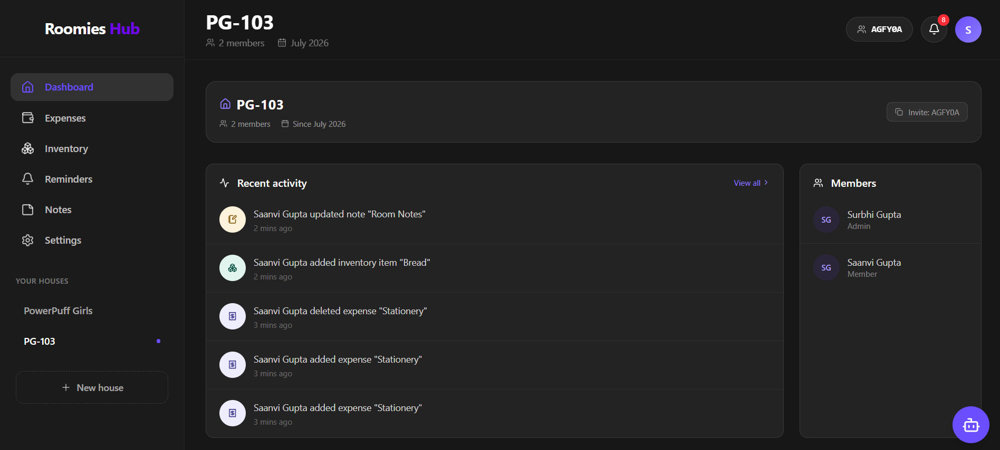
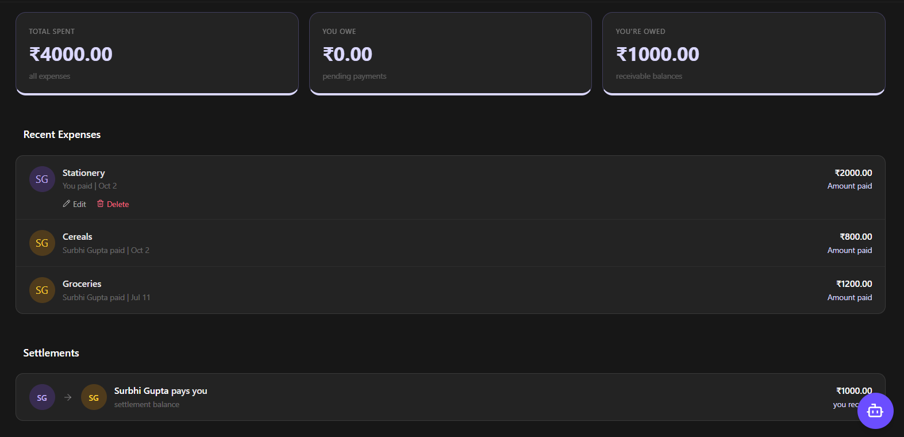
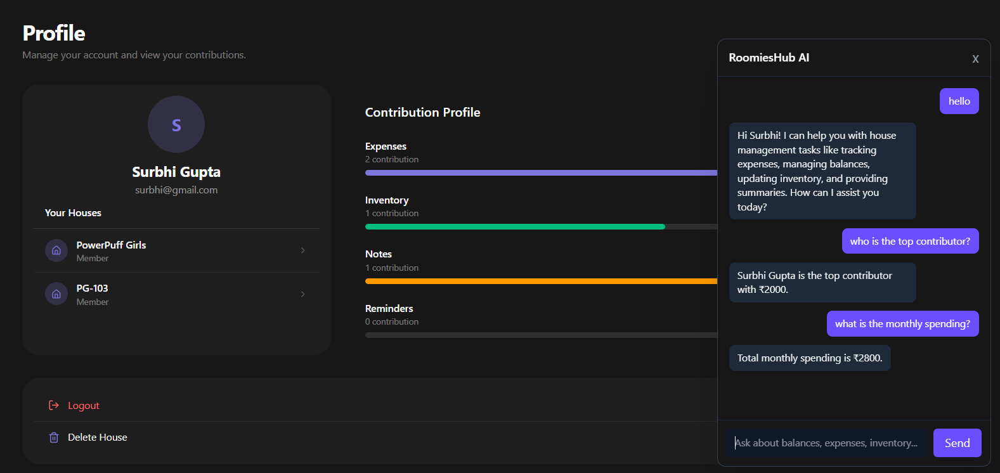
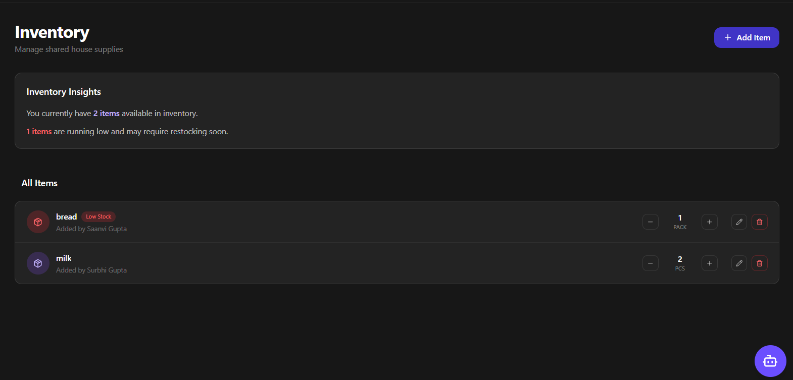

#   RoomiesHub

> A full-stack roommate management platform for managing shared houses, expenses, inventory, communication via notes system, and household reminders.

[![Live Demo]](https://roomies-hub-alpha.vercel.app/)

##  Screenshots

### Dashboard


### Expense & Debt Management


### AI House Assistant


### Inventory


##  Features

###  House Management

* Create a house with a unique 6-character joining code
* Join an existing house using the code
* Manage shared household information

###  Expense & Debt Management

* Add and track shared household expenses
* Track balances between roommates
* Simplify debts to reduce unnecessary transactions

###  Inventory Management

* Track shared household items
* Monitor item quantities
* Identify low-stock items

###  Real-Time Notifications

* Real-time notifications on any activity updates.
* Built with Socket.IO
* Unread counts of notifications displayed real time

###  Authentication

* JWT-based authentication
* Google OAuth authentication
* Protected routes and authenticated API requests

###  AI House Assistant

* AI-powered assistant for household-related queries
* Uses Google Gemini to provide insights based on available house data

###  Automated Reminders

* Scheduled reminder emails for due items
* Automated background jobs using `node-cron`

---

##  Tech Stack

### Frontend

* React
* Tailwind CSS
* JavaScript

### Backend

* Node.js
* Express.js
* Socket.IO

### Database

* MongoDB

### Authentication

* JSON Web Tokens (JWT)
* Google OAuth

### AI

* Google Gemini

### Tools & Deployment

* Git & GitHub
* Postman
* Vercel
* Render

---

---

##  Project Structure

```text
RoomiesHub/
│
├── frontend/          # React frontend
│
├── backend/           # Node.js + Express backend
│
├── .gitignore
└── README.md
```

---

##  Live Demo

**Frontend:**
https://roomies-hub-alpha.vercel.app/

> The application requires authentication to access household-specific functionality.

---

##  Running Locally

### 1. Clone the repository

```bash
git clone https://github.com/Saanvi8888/RoomiesHub.git
cd RoomiesHub
```

### 2. Install frontend dependencies

```bash
cd frontend
npm install
```

### 3. Install backend dependencies

```bash
cd ../backend
npm install
```

### 4. Configure environment variables

Create the required `.env` files for the frontend and backend.

Typical configuration includes:

**Backend**

```env
MONGO_URI=
JWT_SECRET=
GOOGLE_CLIENT_ID=
GEMINI_API_KEY=
```

**Frontend**

```env
VITE_GOOGLE_CLIENT_ID=
VITE_API_URL=
```

> Never commit `.env` files or API keys to the repository.

### 5. Start the backend

```bash
cd backend
npm run dev
```

### 6. Start the frontend

In a separate terminal:

```bash
cd frontend
npm run dev
```

The frontend will then be available through the local development server.

---

##  Key Implementation Highlights

* **JWT authentication** for protected application routes
* **Google OAuth** for third-party authentication
* **Socket.IO** for real-time notifications
* **MongoDB** for persistent application data
* **Node-cron** for scheduled reminder jobs
* **Gemini AI** for the House Assistant
* REST APIs connecting the React frontend with the Node.js backend

---

##  Future Improvements

* Enhanced household analytics
* More advanced expense visualizations
* Additional AI-powered household features

---

##  Author

**Saanvi Gupta**

[GitHub](https://github.com/Saanvi8888)
